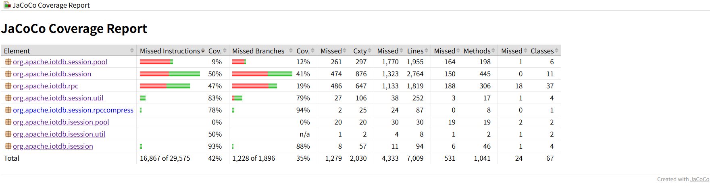

# java-native-api-test

Test the java native api of iotdb.
This project is developed by java, maven and TestNG.

## required environment

jdk: >= 1.8
maven: >= 3.8.1
iotdb: = 2.0.6-SNAPSHOT

## configuration

1. The iotdb connection(default is localhost):
```shell
common/src/resources/config.properties
```
2. The iotdb-session dependency: the pom.xml of project
3. Configure running test cases: 

```shell
details/src/resources/testng.xml 
```

（Note: Running in Linux and Windows environments requires modifying the corresponding configuration in `org/Apache/iotdb/API/test/utls/Customs Data Provider. java`）

## functional Testing

### Operation steps

Modify the `config.properties`configuration file,configure the iotdb connection,and use the default configuration for the rest.

```shell
# 1. compile jar
mvn clean package -DskipTests
# 2. run tests and generate html report
mvn surefire-report:report
```

Running time is approximately 30 minutes

### report

After running, here is the reports:
```shell
details/target/site/surefire-report.html
```


## Coverage Testing

### Operation steps

Modify the `config.properties`configuration file,configure the iotdb connection,and make `is_coverage=true`,finally,run the `run_coverage.xx` script file.

### report

After running, here is the reports:

```shell
jacoco/report/index.html
```

