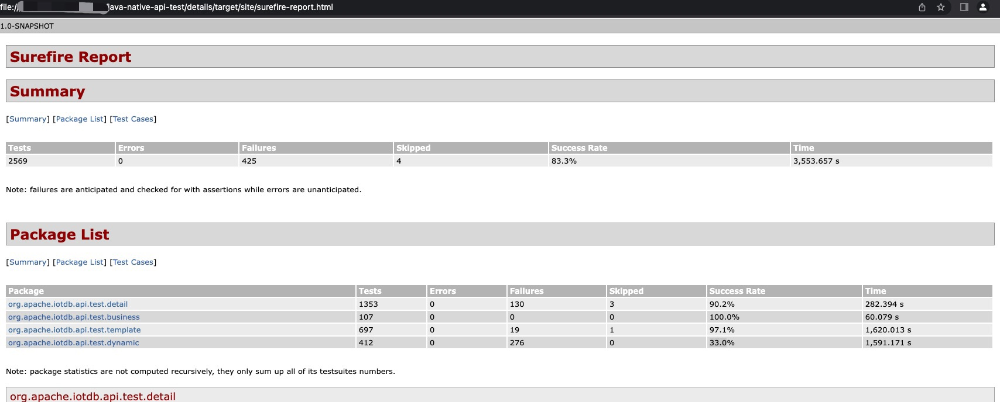
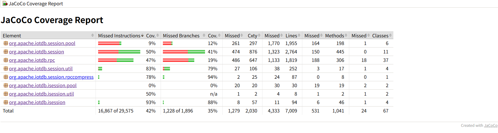

# Java Native API Test Cases

Apache IoTDB Java Native API 自动化测试工程，基于 Maven 与 TestNG 组织测试用例。

## 项目结构

```text
.
├── assets/                         # README 图片资源
├── code/                           # 覆盖率分析源码目录
│   ├── classes/                    # 存放class 文件
│   ├── src/                        # 存放java文件
├── common/                         # 公共模块
│   ├── src/main/java/              # 公共测试基类、工具类
│   ├── src/main/resources/         # 包括连接配置文件、TestNG 配置、CSV 测试数据
│   └── src/test/resources/         # 测试日志配置
├── details/                        # 具体测试用例模块
│   ├── src/main/resources/         # 主测试套件 testng.xml
│   └── src/test/java/              # 具体测试用例
├── jacoco/                         # JaCoCo agent、CLI 与覆盖率报告目录
├── run_coverage.bat                # Windows 覆盖率执行脚本
├── run_coverage.sh                 # Linux/macOS 覆盖率执行脚本
├── pom.xml                         # Maven 父工程
└── README.md                       # 项目说明
```

## 环境要求

| 组件 | 要求 |
| --- | --- |
| JDK | 17+ |
| Maven | 3.9.8+ |
| IoTDB | 与 `pom.xml` 中 `iotdb.version` 保持一致 |

> 说明：项目源码编译目标为 Java 17，构建与测试请使用 JDK 17+。

## 配置说明

### 1. IoTDB 连接配置文件

位于 `common/src/main/resources/config.properties`。

### 2. IoTDB 依赖版本

IoTDB Java 客户端依赖版本统一在根目录 `pom.xml` 中维护。切换测试目标版本时，请同步修改 `iotdb.version`，并确保本地或远程 Maven 仓库中存在对应依赖。

### 3. TestNG 用例范围

测试套件文件位于 `details/src/main/resources/testng.xml`，可通过增删 `<class>` 节点调整执行的测试范围。

## 功能测试

1. 启动待测 IoTDB 实例。
2. 修改 `common/src/main/resources/config.properties`，确保连接配置正确。
3. 执行 Maven 构建：

```bash
mvn clean package -DskipTests
```

4. 执行测试并生成报告：

```bash
mvn surefire-report:report
```

测试报告输出路径：`details/target/site/surefire-report.html`



## 覆盖率测试

覆盖率测试通过 JaCoCo 采集 IoTDB 相关类的执行覆盖率。

1. 将 `common/src/main/resources/config.properties` 中的 `is_coverage` 设置为 `true`。
2. 准备覆盖率所需源码文件：
   `code/src/`：放置待分析源码
3. 执行脚本：

Windows

```bash
run_coverage.bat
```

Linux/macOS

```bash
./run_coverage.sh
```

覆盖率报告输出路径：`jacoco/report/index.html`



> 注意：功能测试请保持 `is_coverage=false`，仅在覆盖率测试时改为 `true`。

## 常见问题

- 依赖下载失败：当前项目依赖 `2.0.7-SNAPSHOT`，请确认网络可访问对应 Maven 仓库，或提前将依赖安装到本地仓库。
- IoTDB 连接失败：确认 IoTDB 已启动，并检查 `host`、`port`、`url`、`user`、`password` 配置是否正确。
- CSV 解析或数据驱动异常：功能测试请不要开启 `is_coverage`，并确认测试数据文件位于 `common/src/main/resources/data`。
